# Airline Policies Chatbot

A Retrieval-Augmented Generation (RAG) chatbot application that answers questions about airline travel policies for major airlines. This chatbot uses LangChain to process airline policy documents, stores vector embeddings in PostgreSQL with pgvector, and provides a conversational interface powered by OpenAI's GPT models.

## Overview

This chatbot application was designed to demonstrate deployment to **Akamai App Platform** using **Linode Kubernetes Engine (LKE)**. It showcases a complete RAG (Retrieval-Augmented Generation) pipeline that:

- Processes airline policy documents (PDF, HTML, TXT) from Linode Object Storage
- Generates vector embeddings using OpenAI's embedding models
- Stores embeddings in PostgreSQL with pgvector extension for semantic search
- Maintains conversation history using LangGraph with PostgreSQL checkpointing
- Provides a web-based chat interface for querying airline policies
- Uses OpenAI's chat completion API for generating contextual responses

## Technology Stack

- **Backend**: FastAPI (Python 3.11)
- **RAG Framework**: LangChain, LangGraph
- **Vector Database**: PostgreSQL with pgvector extension
- **Conversation State**: PostgreSQL with LangGraph checkpointing
- **Document Storage**: Linode Object Storage (S3-compatible)
- **AI/ML**: OpenAI API (embeddings and chat completions)
- **Deployment**: Akamai App Platform on Linode Kubernetes Engine
- **Infrastructure**: Terraform for Linode resource provisioning

## Prerequisites

- Linode account with API key
- OpenAI API key
- Terraform installed
- kubectl installed
- s3cmd installed (for uploading documents)

## Deployment Steps

### 1. Clone this repository

Clone the repository to your local machine to get started with the deployment process.

```bash
git clone <repository-url> project
cd project
```

### 2. Create a Linode API key

In the Akamai Cloud Console, create a Linode API key with read/write permissions for databases, Linodes, Kubernetes, and object storage, and read permissions for events.

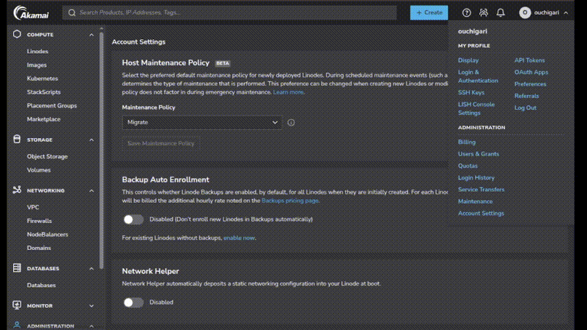
([Go to high-resolution screencast](./screencasts/01-Linode-API-Key.mp4))

### 3. Configure Terraform variables

Copy the `terraform/terraform.tfvars.example` file as `terraform.tfvars` and edit it to add your Linode API key and make any other desired non-default configurations.

```bash
cp terraform/terraform.tfvars.example terraform/terraform.tfvars
# Edit terraform.tfvars with your API key and settings
```

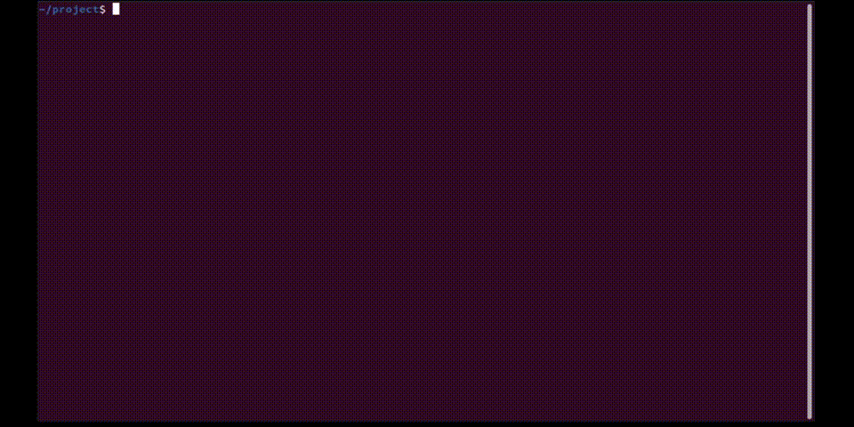
([Go to high-resolution screencast](./screencasts/02-Copy-tfvars.mp4))

### 4. Apply Terraform configuration

Run Terraform to provision the required infrastructure (PostgreSQL database for vectors, PostgreSQL database for conversation state, LKE cluster, object storage bucket for knowledge base documents).

```bash
cd terraform
terraform init
terraform plan
terraform apply
```

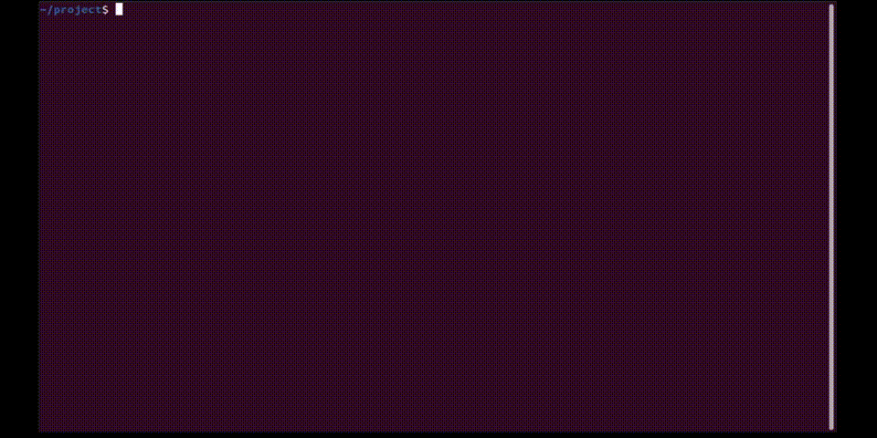
([Go to high-resolution screencast](./screencasts/03-Terraform-Apply.mp4))

### 5. Capture Terraform outputs

Capture the Terraform outputs to a JSON file for easy access, but keep this file secure since it contains sensitive information like database connection strings and API keys.

```bash
terraform output -json > terraform.output.json
```

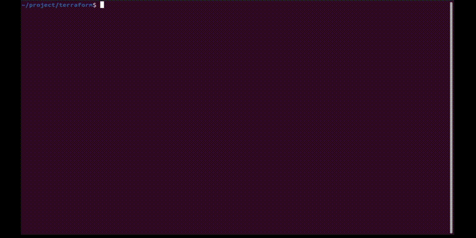
([Go to high-resolution screencast](./screencasts/04-Terraform-Outputs.mp4))

### 6. Upload documents to Object Storage

Use s3cmd to upload files in the `documents/` folder to the Linode Object Storage bucket created by Terraform.

```bash
export S3_BUCKET=$(terraform output -raw S3_BUCKET_NAME)
export S3_ENDPOINT=$(terraform output -raw S3_ENDPOINT)
export S3_ACCESS_KEY=$(terraform output -raw S3_ACCESS_KEY)
export S3_SECRET_KEY=$(terraform output -raw S3_SECRET_KEY)

s3cmd sync ../documents/ s3://${S3_BUCKET}/ \
  --host=${S3_ENDPOINT} \
  --host-bucket=${S3_ENDPOINT} \
  --access_key=${S3_ACCESS_KEY} \
  --secret_key=${S3_SECRET_KEY}
```

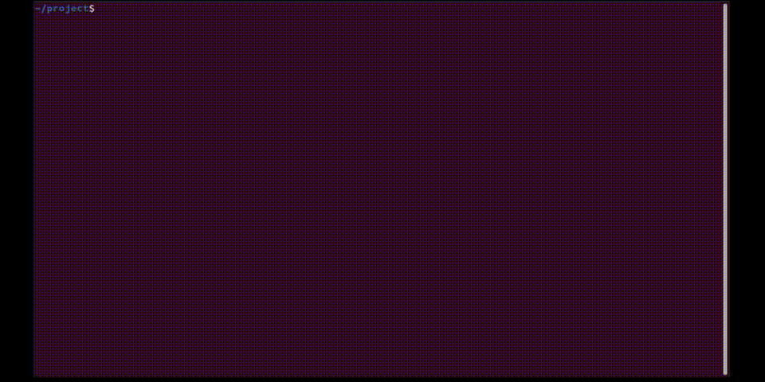
([Go to high-resolution screencast](./screencasts/05-Upload-Documents.mp4))

### 7. Get App Platform credentials

When the App Platform endpoint is available, use kubectl and the generated kubeconfig to get App Platform credentials for accessing your Kubernetes cluster.

```bash
export KUBECONFIG=./kubeconfig.yaml
kubectl get secret platform-admin-initial-credentials \
  -n keycloak \
  --template={{.data.username}} \
  | base64 -d

kubectl get secret platform-admin-initial-credentials \
  -n keycloak \
  --template={{.data.password}} \
  | base64 -d
```

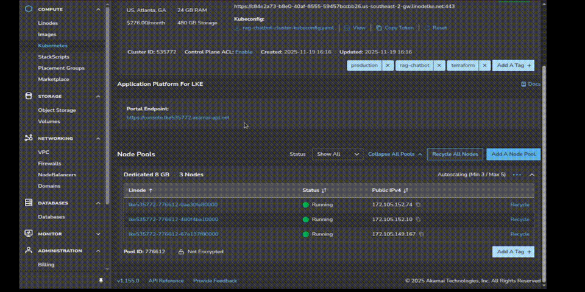
([Go to high-resolution screencast](./screencasts/06-AppPlatform-Credentials.mp4))

### 8. Sign in to App Platform

Sign in to Akamai App Platform using your credentials. You'll be prompted to create a new password.


([Go to high-resolution screencast](./screencasts/07-AppPlatform-First-Sign-In.mp4))

### 9. Allow Object Storage bucket creation

Allow App Platform to create the necessary object storage buckets by providing your Linode API key and specifying a region for the buckets. For optimal performance, select the same region you used with Terraform to provision resources.

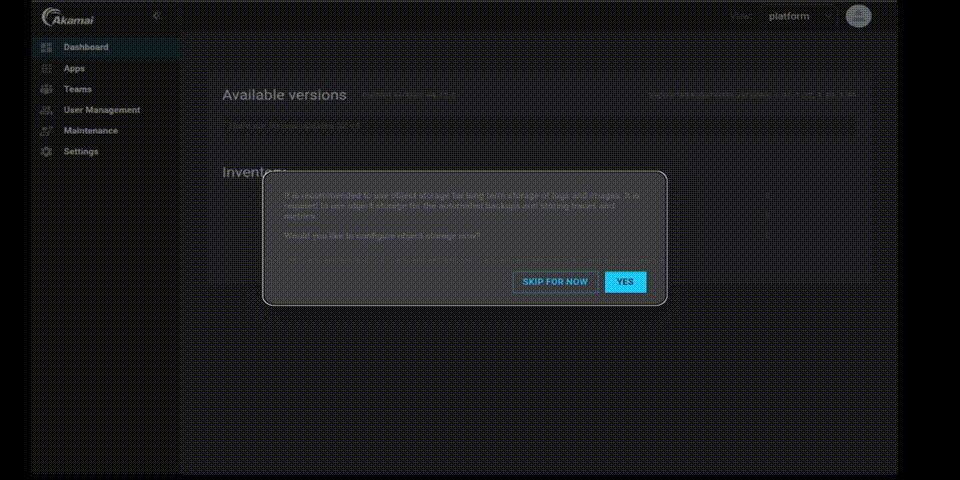
([Go to high-resolution screencast](./screencasts/08-AppPlatform-Create-Buckets.mp4))

### 10. Install the Harbor app

Install the Harbor container registry app in App Platform to store your container images.

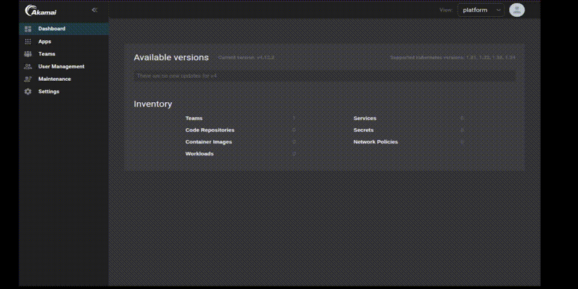
([Go to high-resolution screencast](./screencasts/09-Install-Harbor.mp4))

### 11. Switch to Team view

Switch to the Team view in App Platform.

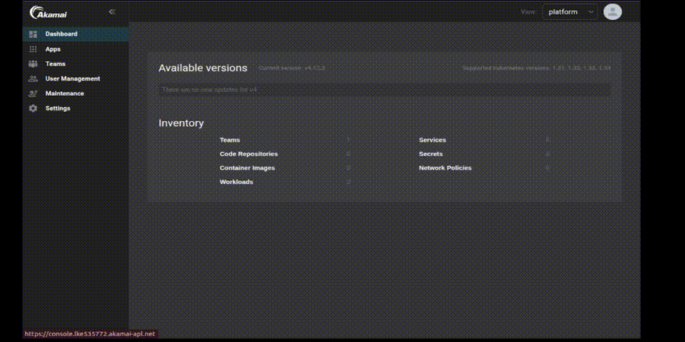
([Go to high-resolution screencast](./screencasts/10-Switch-Team-View-960x480.mp4))

### 12. Generate GitHub deploy key

Generate a public/private key pair to serve as your GitHub deploy key, so that App Platform can access your repository securely. **Important**: Do not add a passphrase to your key.

```bash
ssh-keygen -t rsa -b 4096 -C "your.email@example.com" -f my-github-key
```

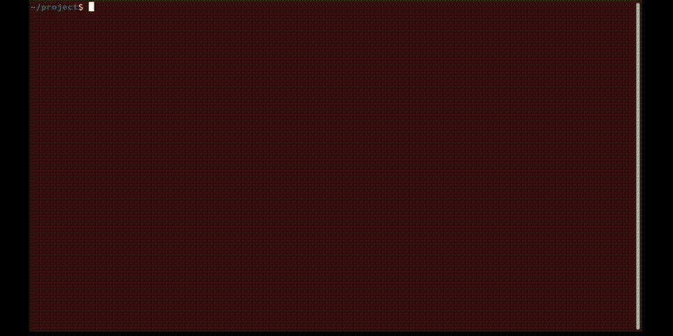
([Go to high-resolution screencast](./screencasts/11-Generate-GitHub-Key.mp4))

### 13. Add deploy key to repository

Add the public key to your GitHub repository's list of deploy keys in settings.

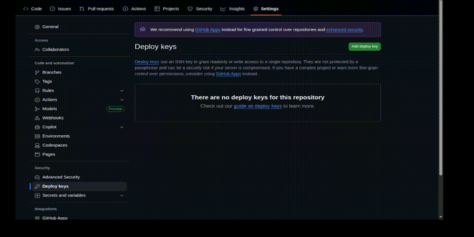
([Go to high-resolution screencast](./screencasts/12-Add-GitHub-Deploy-Key.mp4))

### 14. Add private key as Sealed Secret

Add the private key as a Sealed Secret in App Platform.


([Go to high-resolution screencast](./screencasts/13-Add-GitHub-Key-Sealed-Secret.mp4))

### 15. Add code repository

Add a code repository in App Platform, connecting it to your GitHub repository using the Sealed Secret you created.

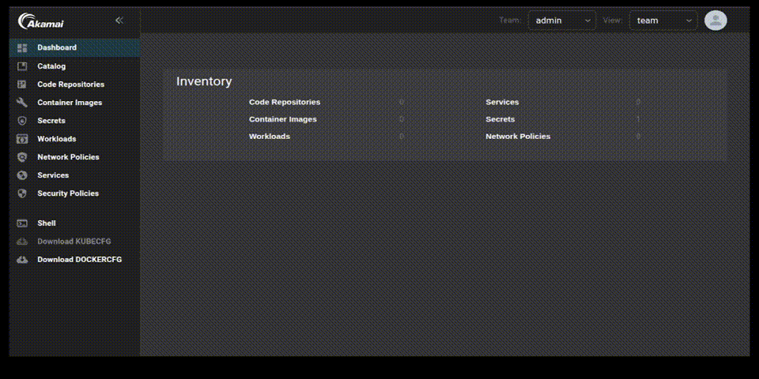
([Go to high-resolution screencast](./screencasts/14-Add-Code-Repository.mp4))

### 16. Build container image

Build the container image using the Dockerfile in the repository.

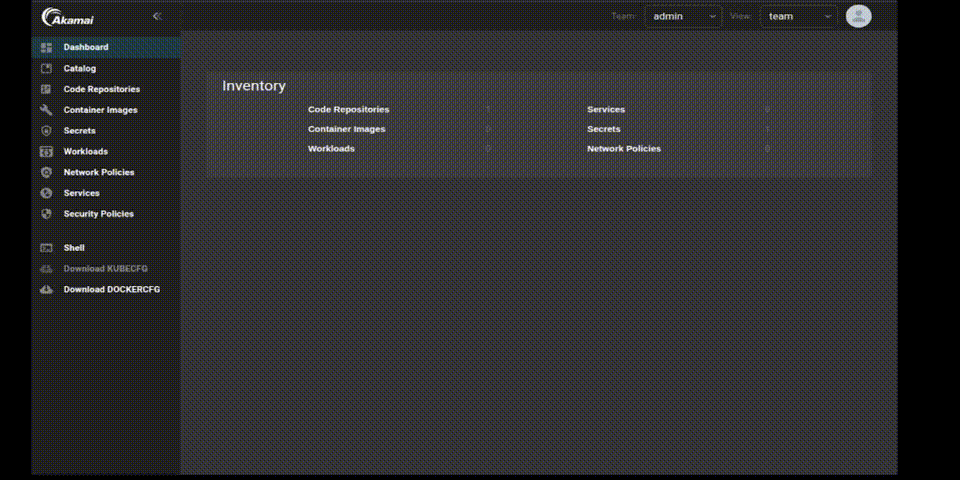
([Go to high-resolution screencast](./screencasts/15-Build-Container-Image.mp4))

### 17. Add sealed secrets

Add the following Sealed Secrets in App Platform to securely store sensitive information.

#### OpenAI API Key
OpenAI API key, used for making embeddings and chat completion API calls.

Create an API key at OpenAI. Copy it.

Create a Sealed Secret in App Platform to store it.

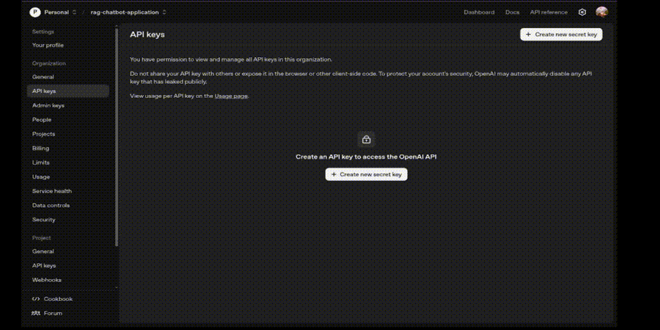
([Go to high-resolution screencast](./screencasts/16-Add-OpenAI-Secret.mp4))

#### Database credentials
PostgreSQL database connection strings for both the vector database and conversation state database (found in your terraform outputs JSON file).

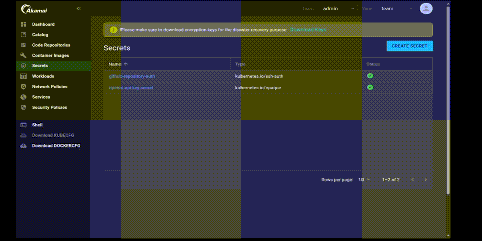
([Go to high-resolution screencast](./screencasts/17-Add-Database-Secrets.mp4))

#### Object storage bucket access
Linode Object Storage access key and secret key for accessing document storage (found in your terraform outputs JSON file).

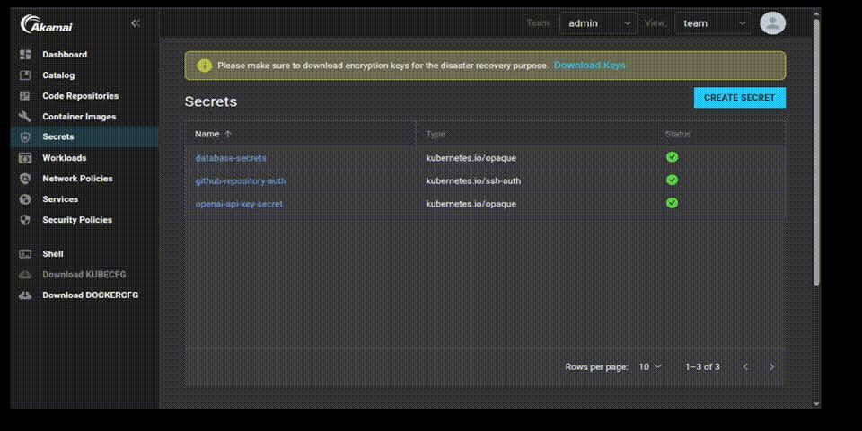
([Go to high-resolution screencast](./screencasts/18-Add-Object-Storage-Secrets.mp4))

#### Application admin API Key
Admin API key for authenticating admin endpoints like database initialization and document indexing.

Specify an API key value and store it directly as a Sealed Secret.

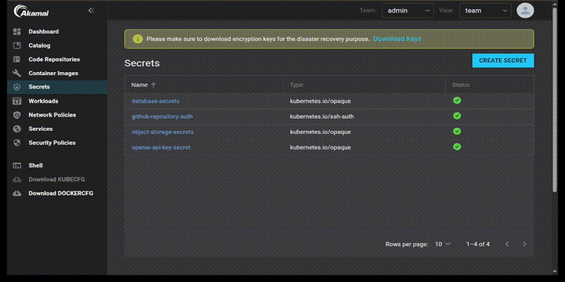
([Go to high-resolution screencast](./screencasts/19-Add-Admin-API-Secret.mp4))

### 18. Add network policies

Add network policies to give outbound access to the two managed PostgreSQL databases from your application pods. Retrieve the database server URLs from the connections strings found in your terraform outputs JSON file.

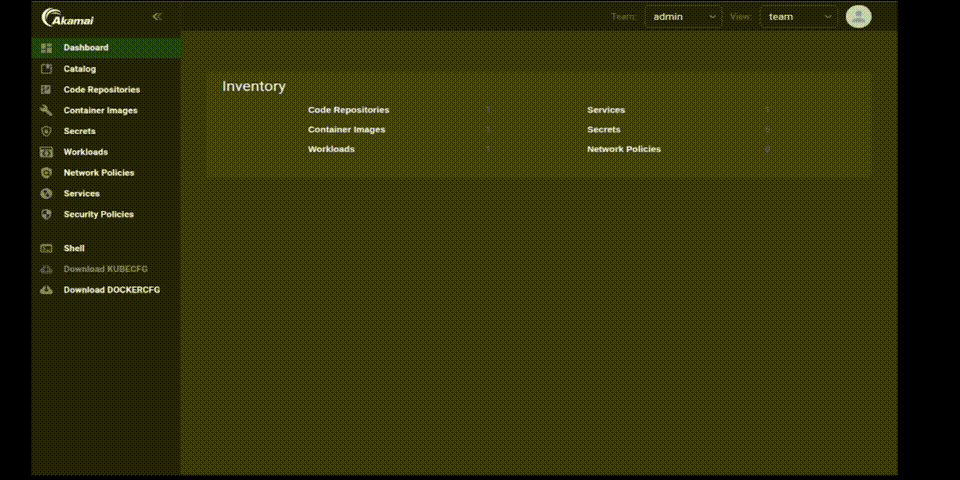
([Go to high-resolution screencast](./screencasts/20-Create-Network-Policy.mp4))

### 19. Create workload

Create a workload using the chart template in `charts/workflow.example.yaml`, configuring it with your container image repository URL and object storage configurations. Sensitive information references the Sealed Secrets you created.

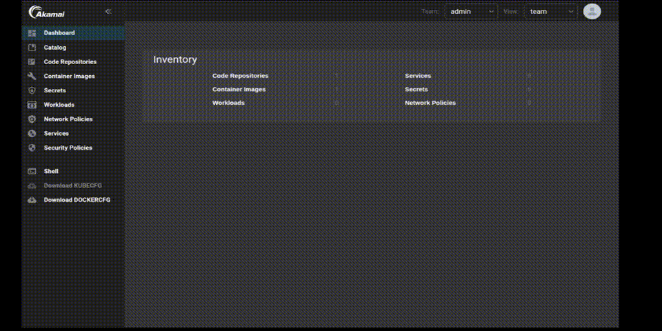
([Go to high-resolution screencast](./screencasts/21-Create-Workload.mp4))

### 20. Create service

Create a service to expose your application for public acces

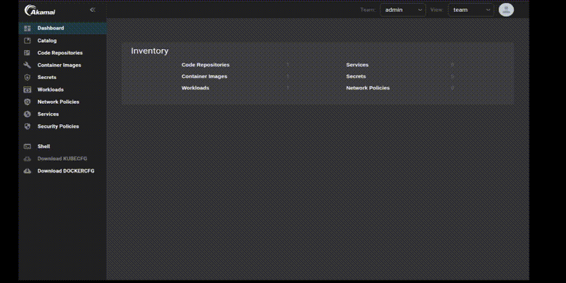
([Go to high-resolution screencast](./screencasts/22-Create-Service.mp4))

### 21. Test health check

Send a health check request with curl to verify the application is running and responding correctly.

```bash
curl http://<your-service-endpoint>/api/health
```

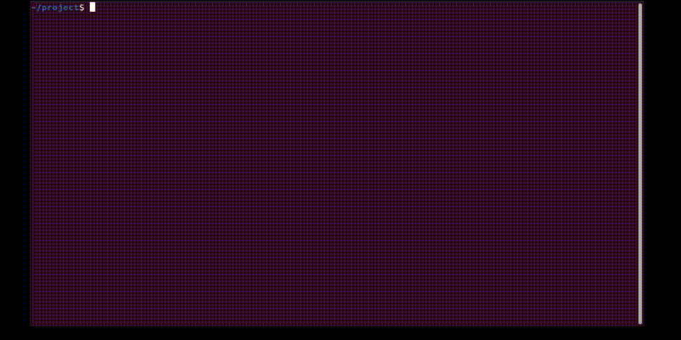
([Go to high-resolution screencast](./screencasts/23-Health-Check.mp4))

### 22. Initialize databases

Send an admin request with curl to initialize databases, creating the necessary tables and extensions.

```bash
curl \
  -X POST \
  --header "x-api-key: <your-admin-api-key>" \
  http://<your-service-endpoint>/api/admin/initialize_databases
```

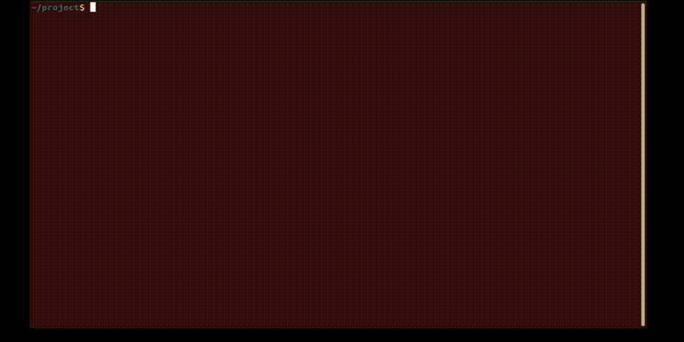
([Go to high-resolution screencast](./screencasts/24-Initialize-Databases.mp4))

### 23. Index documents

Send an admin request with curl to index documents, which will process all documents in Object Storage and create vector embeddings.

```bash
curl \
  -X POST \
  --header "x-api-key: <your-admin-api-key>" \
  http://<your-service-endpoint>/api/admin/index_documents
```

Note: This initiates a background job and then returns a job ID. Check the status with:

```bash
curl \
  -X GET \
  --header "x-api-key: <your-admin-api-key>" \
  http://<your-service-endpoint>/api/admin/index_documents/<job-id>
```

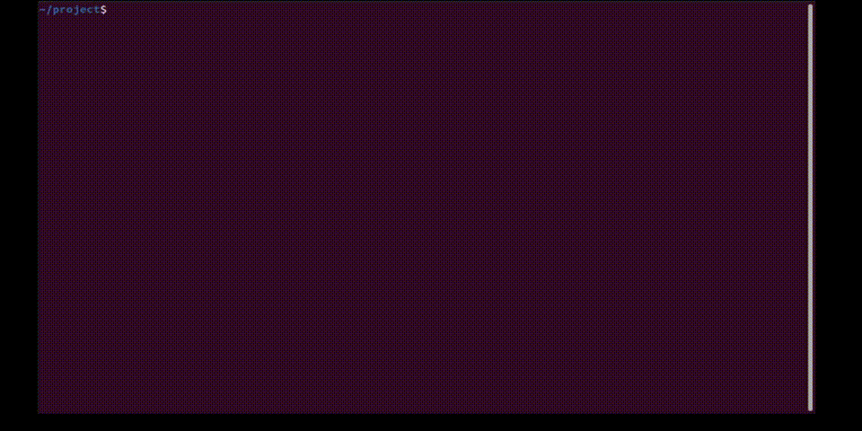
([Go to high-resolution screencast](./screencasts/25-Index-Documents.mp4))

### 24. Test the chatbot

Open your browser to the service endpoint to test the final chatbot application and interact with it through the web interface.

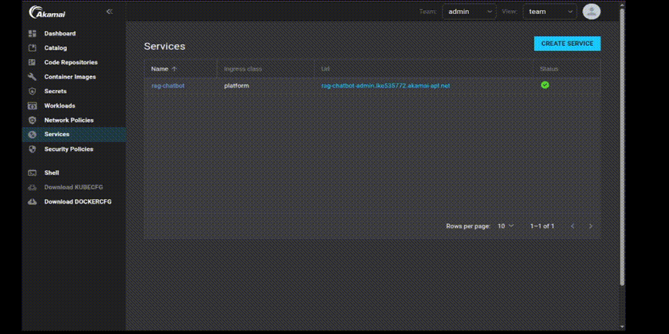
([Go to high-resolution screencast](./screencasts/26-Demo-Chatbot.mp4))

## Application Architecture

### Components

- **FastAPI Application**: Main web server handling HTTP requests
- **RAG Pipeline**: LangChain-based retrieval and generation system
- **Vector Store**: PostgreSQL with pgvector for semantic search
- **Conversation Memory**: LangGraph with PostgreSQL checkpointing
- **Document Loader**: Custom S3-compatible loader for PDF, HTML, and TXT files
- **Admin API**: Endpoints for database initialization and document indexing
- **Chat API**: Endpoints for conversational interactions

### API Endpoints

- `GET /api/health` - Health check endpoint (optional `?services=true` for detailed checks)
- `POST /api/chat` - Chat endpoint for user queries
- `POST /api/admin/initialize_databases` - Initialize database schemas
- `POST /api/admin/index_documents` - Trigger background document indexing
- `GET /api/admin/index_documents/{job_id}` - Check indexing job status
- `GET /api/admin/list_documents` - List documents in Object Storage

## Configuration

The application uses environment variables for configuration. Key variables include:

- `OPENAI_API_KEY` - OpenAI API key for embeddings and chat
- `VECTOR_DB_CONNECTION_STRING` - PostgreSQL connection for vector storage
- `CONVERSATION_DB_CONNECTION_STRING` - PostgreSQL connection for conversation state
- `S3_ENDPOINT` - Linode Object Storage endpoint
- `S3_BUCKET_NAME` - Linode Object Storage bucket name
- `S3_ACCESS_KEY` - Linode Object Storage access key
- `S3_SECRET_KEY` - Linode Object Storage secret key
- `ADMIN_API_KEY` - Admin API key for authentication

## Document Format

Documents should be uploaded to Object Storage in the root of the bucket. A `metadata.csv` file can be included with the following columns:

- `file_name` - Name of the file
- `airline` - Airline name
- `reference_url` - Reference URL for the document
- `document_date` - Document date
- `description` - Description of the document
